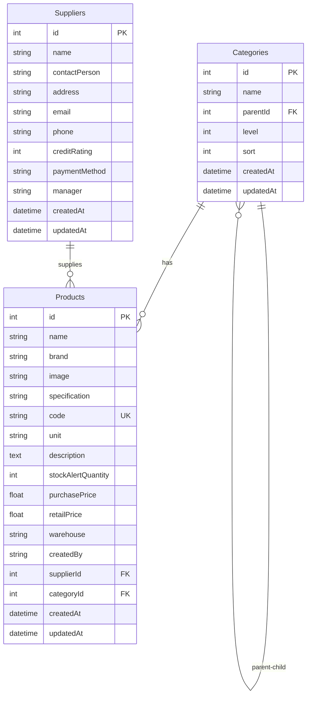
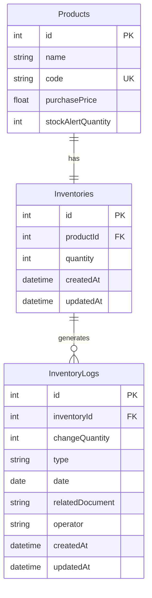
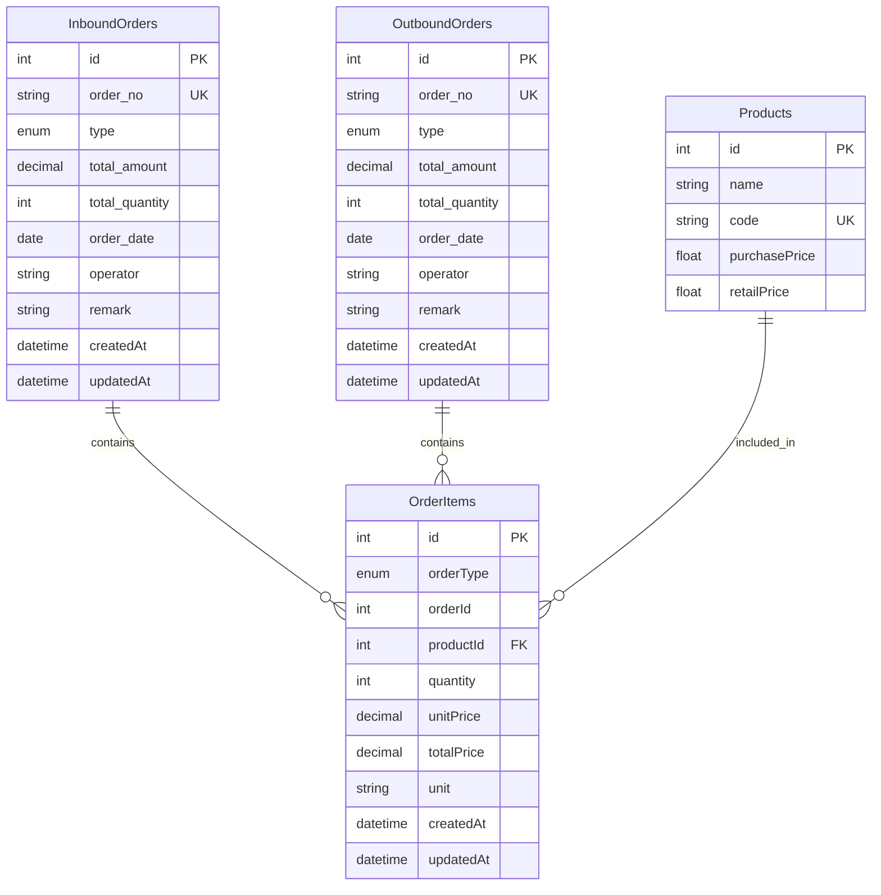
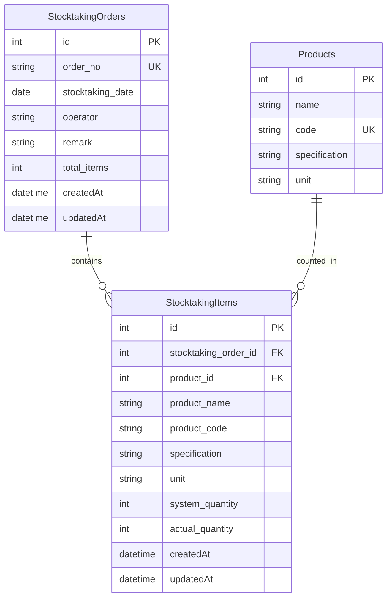
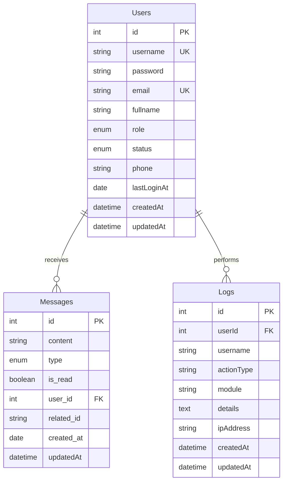
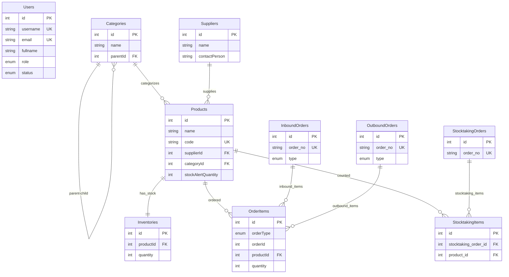
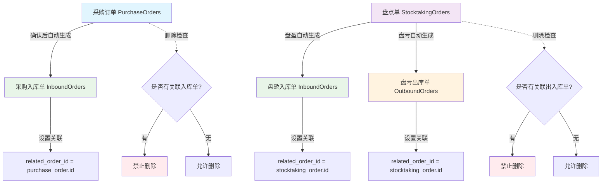

# WMS 仓库管理系统核心表 ER 图

## 1. 商品管理模块 ER 图



## 2. 库存管理模块 ER 图



## 3. 订单管理模块 ER 图



## 4. 盘点管理模块 ER 图



## 5. 用户与系统管理模块 ER 图



## 6. 完整系统核心关系图



## ER 图说明

### 关系类型说明
- **||--||** : 一对一关系
- **||--o{** : 一对多关系  
- **}o--o{** : 多对多关系

### 字段类型说明
- **PK** : Primary Key (主键)
- **FK** : Foreign Key (外键)
- **UK** : Unique Key (唯一键)

### 核心业务关系
1. **商品分类**: Categories 支持多级分类结构
2. **商品供应**: Suppliers 与 Products 一对多关系
3. **库存管理**: Products 与 Inventories 一对一关系
4. **订单系统**: 通过 OrderItems 实现多态关联，支持入库单和出库单
5. **盘点业务**: StocktakingOrders 与 Products 通过 StocktakingItems 关联

### 数据完整性保证
- 外键约束确保引用完整性
- 唯一约束防止数据重复
- 枚举类型限制数据取值范围
- 非空约束保证必要数据完整

这些 ER 图展示了 WMS 系统的核心数据结构和表之间的关联关系，为系统开发和维护提供了清晰的数据模型参考。

## 7. 业务逻辑关联关系说明

### 关联字段设计

#### InboundOrders 入库单关联
- **related_order_id**: 关联订单ID
  - 采购入库：关联采购订单ID (purchase_orders.id)
  - 盘盈入库：关联盘点单ID (stocktaking_orders.id)
  - 手动入库：值为 NULL

#### OutboundOrders 出库单关联
- **related_order_id**: 关联订单ID
  - 盘亏出库：关联盘点单ID (stocktaking_orders.id)
  - 手动出库：值为 NULL

### 业务流程关联图



### 删除保护机制

#### 采购订单删除保护
```sql
-- 检查采购订单是否有关联入库单
SELECT COUNT(*) FROM inbound_orders 
WHERE related_order_id = ? AND type = 'PURCHASE'
```

#### 盘点单删除保护
```sql
-- 检查盘点单是否有关联出入库单
SELECT 
  (SELECT COUNT(*) FROM inbound_orders WHERE related_order_id = ? AND type = 'STOCK_IN') +
  (SELECT COUNT(*) FROM outbound_orders WHERE related_order_id = ? AND type = 'STOCK_OUT') 
  AS total_related
```

### 前端显示逻辑

#### 入库单关联来源显示
- **采购入库** (type='PURCHASE' && related_order_id): 显示"采购单"标签
- **盘盈入库** (type='STOCK_IN' && related_order_id): 显示"盘点单"标签  
- **手动入库** (related_order_id IS NULL): 显示"手动创建"标签

#### 出库单关联来源显示
- **盘亏出库** (type='STOCK_OUT' && related_order_id): 显示"盘点单"标签
- **手动出库** (related_order_id IS NULL): 显示"手动创建"标签

### 业务规则总结

1. **采购单逻辑**：
   - 新建采购单 → 创建采购明细
   - 采购单确认 → 创建采购入库单 (设置 related_order_id)
   - 删除采购单 → 检查关联入库单，如有则禁止删除

2. **盘点单逻辑**：
   - 新建盘点单 → 创建盘点明细
   - 盘盈处理 → 创建盘盈入库单 (设置 related_order_id)
   - 盘亏处理 → 创建盘亏出库单 (设置 related_order_id)
   - 删除盘点单 → 检查关联出入库单，如有则禁止删除

3. **出入库单逻辑**：
   - 新建出入库单 → 创建明细 → 更新库存 → 创建库存流水
   - 删除出入库单 → 删除明细 → 回退库存 → 删除库存流水

这些关联关系和业务规则确保了系统数据的完整性和一致性，为仓库管理提供了可靠的数据基础。 