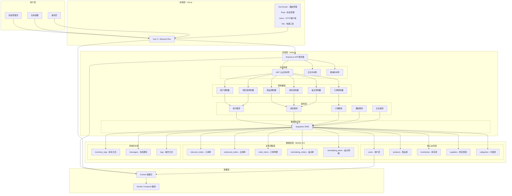
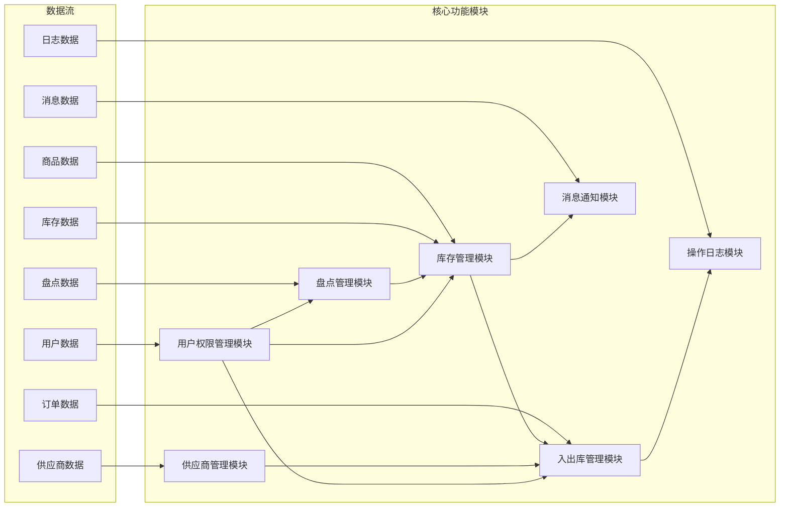
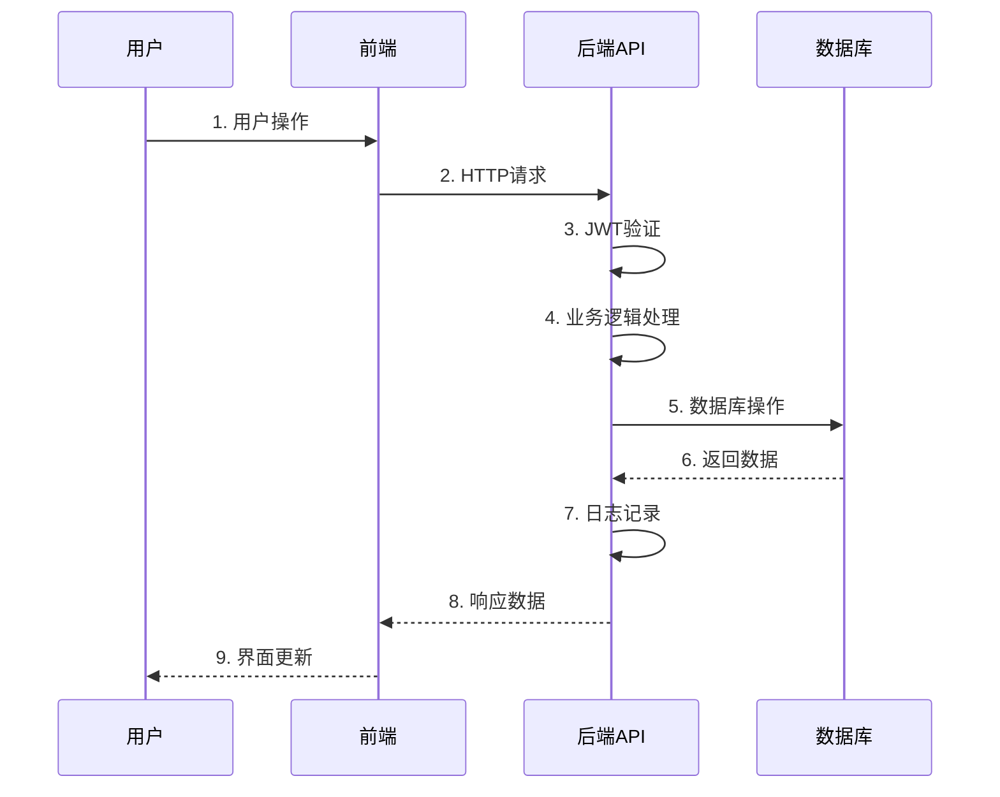
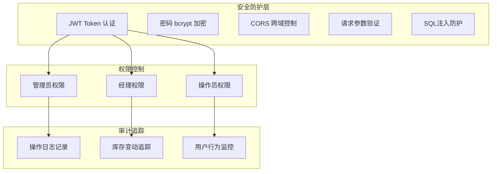

# WMS 仓库管理系统架构图

## 系统整体架构

## 功能模块架构

## 技术栈详细说明

### 前端技术栈
- **Vue 3**: 渐进式 JavaScript 框架
- **Element Plus**: Vue 3 UI 组件库
- **Vue Router**: 客户端路由管理
- **Pinia**: 状态管理库
- **Axios**: HTTP 客户端库
- **Vite**: 快速构建工具

### 后端技术栈
- **Node.js**: JavaScript 运行环境
- **Express.js**: Web 应用框架
- **Sequelize**: Promise-based ORM
- **JWT**: JSON Web Token 认证
- **bcryptjs**: 密码哈希库
- **Winston**: 日志记录库

### 数据库设计
- **MySQL 8.0**: 关系型数据库
- **13张核心表**: 支撑完整业务流程
- **外键关联**: 保证数据完整性
- **索引优化**: 提升查询性能

### 部署架构
- **Docker**: 应用容器化
- **Docker Compose**: 多容器编排
- **环境隔离**: 开发/测试/生产环境分离

## 数据流向图

## 安全架构

