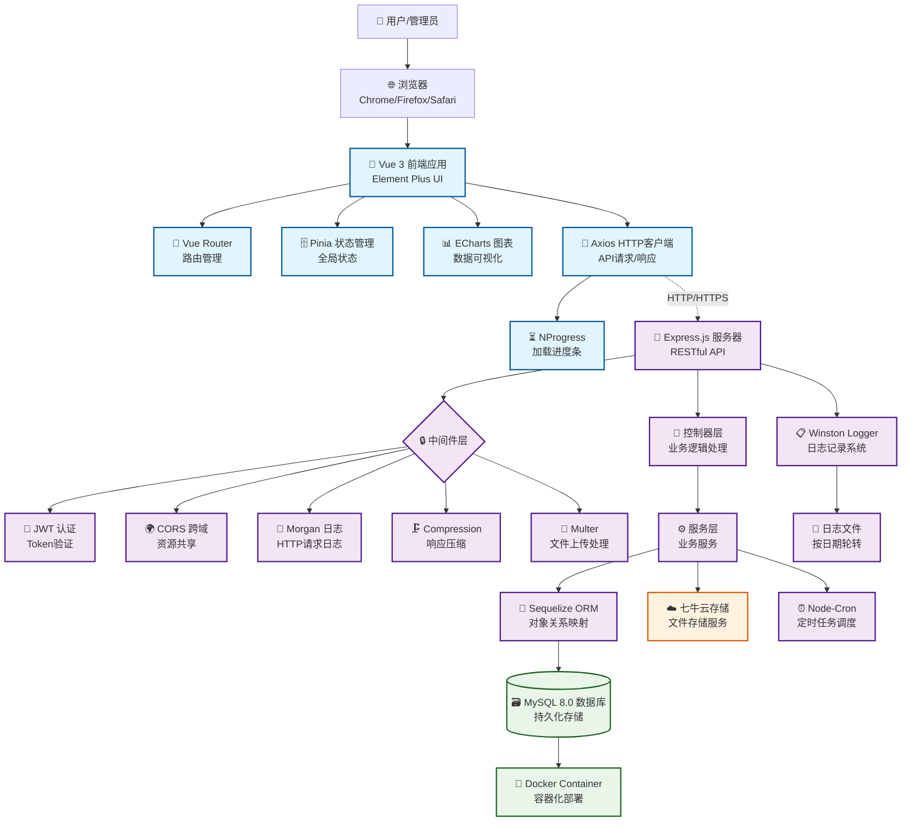
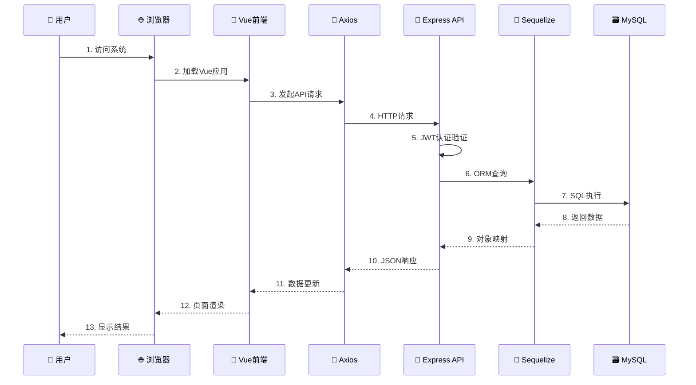
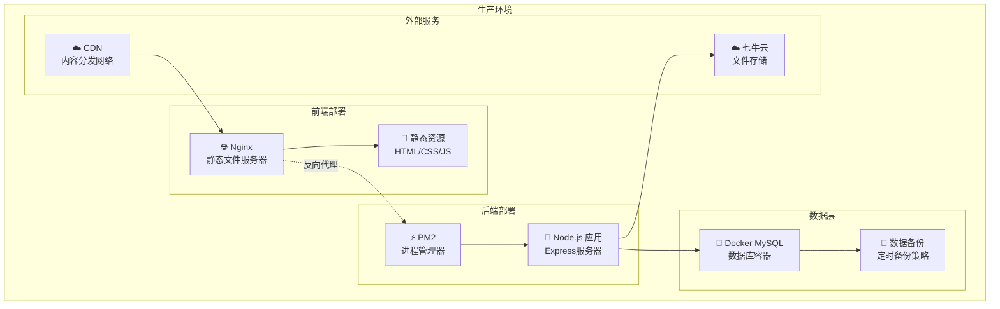

# WMS仓库管理系统 - 系统架构图

## 整体架构概览



## 数据流向图



## 核心技术栈

### 前端技术栈
- **Vue 3**: 渐进式JavaScript框架
- **Element Plus**: Vue 3 UI组件库
- **Vite**: 现代化构建工具
- **Vue Router**: 客户端路由管理
- **Pinia**: 状态管理库
- **Axios**: HTTP客户端库
- **ECharts**: 数据可视化图表库
- **Sass**: CSS预处理器

### 后端技术栈
- **Express.js**: Node.js Web应用框架
- **Sequelize**: MySQL/PostgreSQL/SQLite ORM
- **JWT**: JSON Web Token认证
- **bcryptjs**: 密码加密库
- **Winston**: 日志记录库
- **Multer**: 文件上传中间件
- **Node-Cron**: 任务调度器

### 数据库与存储
- **MySQL 8.0**: 关系型数据库
- **Docker**: 容器化部署
- **七牛云**: 文件存储服务

### 开发工具
- **ESLint**: 代码质量检查
- **Jest**: 单元测试框架
- **Nodemon**: 开发环境热重载

## 系统特性

### 🔒 安全特性
- JWT Token身份认证
- bcryptjs密码加密
- CORS跨域安全控制
- 请求参数验证

### 📊 监控与日志
- Winston日志系统
- Morgan HTTP请求日志
- 按日期轮转的日志文件
- API响应时间监控

### 🚀 性能优化
- Gzip响应压缩
- 前端资源懒加载
- 数据库查询优化
- 缓存机制

### 🔧 维护性
- RESTful API设计
- 模块化代码结构
- 单元测试覆盖
- Docker容器化部署

## 部署架构



## 接口设计原则

### RESTful API规范
- `GET` - 查询数据
- `POST` - 创建数据
- `PUT` - 更新数据
- `DELETE` - 删除数据

### 统一响应格式
```json
{
  "code": 200,
  "message": "success",
  "data": {},
  "timestamp": "2024-01-01T00:00:00.000Z"
}
```

### 错误处理机制
- 统一错误码定义
- 详细错误信息返回
- 客户端友好的错误提示 